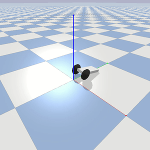
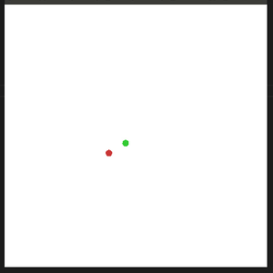
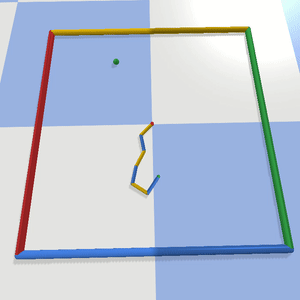
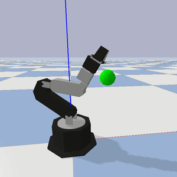
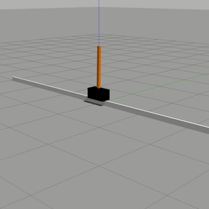
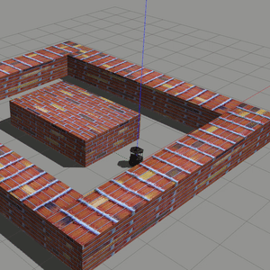
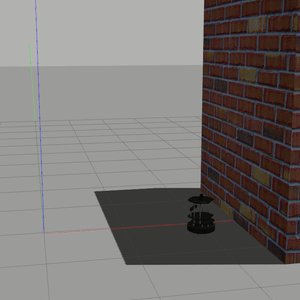
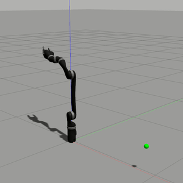
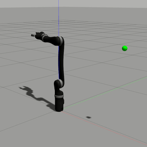

# Custom Gym Environments
Some custom Gym environments for reinforcement learning.

## Installation and environment registration (Pybullet-based environments)

```bash
git clone https://github.com/PierreExeter/custom_gym_envs.git
cd custom_gym_envs/
conda env create -f environment.yml
conda activate gym_envs
pip install -e .   # to register the Gym environmnents locally
```
## Installation of the ROS-based environments

1. Install ROS Melodic

2. Create and initialise your [Catkin workspace](http://wiki.ros.org/ROS/Tutorials/InstallingandConfiguringROSEnvironment).

3. Install the dependencies for the Kinova-ros package, as indicated [here](https://github.com/Kinovarobotics/kinova-ros/wiki/Gazebo).

```bash
sudo apt-get install ros-<distro>-gazebo-ros-control
sudo apt-get install ros-<distro>-ros-controllers*
sudo apt-get install ros-<distro>-trac-ik-kinematics-plugin
sudo apt-get install ros-<distro>-effort-controllers 
sudo apt-get install ros-<distro>-joint-state-controller 
sudo apt-get install ros-<distro>-joint-trajectory-controller 
sudo apt-get install ros-<distro>-controller-*
```

(replace `<distro>` by your ROS distribution, for example `kinetic` or `melodic`)

4. Install ROS packages and create simulation workspace

```bash
mkdir -p ~/simulation_ws/src
cp -r custom_gym_envs/ROS_packages/openai_ros ~/simulation_ws/src

# Alternatively, clone original repository and checkout version2
# git clone https://bitbucket.org/theconstructcore/openai_ros.git
# cd openai_ros
# git checkout version2

cd ~/simulation_ws/
catkin_make
source devel/setup.bash
echo $ROS_PACKAGE_PATH
```

Check that you see something like:

```bash
/home/user/simulation_ws/src:/home/user/catkin_ws/src:/opt/ros/melodic/share
```

```bash
cp -r custom_gym_envs/ROS_packages/custom_ROS_envs/ ~/catkin_ws/src
cd ~/catkin_ws
catkin_make
```

5. Edit ros_ws_abspath 

In each config folder, edit the yaml file and change the ros_ws_abspath to match your path: "/home/user/simulation_ws".
For example:

```bash
vim ~/catkin_ws/src/custom_ROS_envs/cartpole3d_env/config/cartpole3d_random_params.yaml
```

6. Source and load rospack profile

In a new shell, execute:

```bash
cd ~/simulation_ws
catkin_make
source devel/setup.bash
rospack profile
```

In your main shell, execute:

```bash
cd ~/catkin_ws
source devel/setup.bash
rospack profile
```


## Test the ROS-based environments

```bash
roslaunch cartpole3d_env start_training_cartpole3d_random.launch
roslaunch turtlebot2_maze_env start_turtlebot2_maze_random.launch
roslaunch turtlebot2_wall_env start_turtlebot2_wall_random.launch
```


## Test the Pybullet environments

Execute scripts in the test_envs folder. For example:

```bash
python test_envs/4_test_reacher2D.py
```

## Test the Jaco Reach environments in Gazebo

First, execute the ROS launch in a separate terminal:

```bash
roslaunch kinova_gazebo robot_launch_render.launch kinova_robotType:=j2n6s300  # Gazebo simulation
# OR
roslaunch kinova_bringup kinova_robot.launch kinova_robotType:=j2n6s300   # Physical arm
```

Then execute the test script in the test_envs folder. For example:

```bash
python test_envs/8_test_jaco_gazebo_actionlib.py
```

Note, the kinova-ros package was adapted from the [official package](https://github.com/Kinovarobotics/kinova-ros).


## Environments description

| Name     | Action space       | Observation space      | Rewards       |
| ---------| -------------------| -----------------------| ------------- |
| balancebot-v0 | Discrete(9): used to define wheel target velocity | Box(3,): [cube orientation , cube angular velocity , wheel velocity] | 0.1 - abs(self.vt - self.vd) * 0.005 |
| particle-v0 | Box(2,): [force_x, force_y] | Dict("achieved_goal": [coord_x, coord_y], "desired_goal": [coord_x, coord_y], "observation": [pos_x, pos_y, vel_x, vel_y])   | - dist (dense) or bool(dist <= distance_threshold) (sparse) |
| Reacher2Dof-v0 | Box(2,): [0.05 * torque_1, 0.05 * torque_2] | Box(8,): [target_x, target_y, dist_to_target_x, dist_to_target_y, joint0_angle, joint0_vel, joint1_angle, joint1_vel | [change in dist to target, electricity_cost, stuck_joint_cost] |
| Reacher2Dof-v1 | Box(2,): [0.05 * torque_1, 0.05 * torque_2] | Dict("achieved_goal": [tip_x, tip_y], "desired_goal": [target_x, target_y], "observation": *same as above* ) | - dist |
| widowx_reacher-v5 | Box(6,): [angle_change_joint1, angle_change_joint2, angle_change_joint3, angle_change_joint4, angle_change_joint5, angle_change_joint6] | Box(9,): [target_x, target_y, target_z, joint_angle1, joint_angle2, joint_angle3, joint_angle4, joint_angle5, joint_angle6] | - dist ^ 2 |
| widowx_reacher-v7 | Box(6,): [angle_change_joint1, angle_change_joint2, angle_change_joint3, angle_change_joint4, angle_change_joint5, angle_change_joint6] | Dict("achieved_goal": [tip_x, tip_y, tip_z], "desired_goal": [target_x, target_y, target_z], "observation": *same as above* ) | - dist ^ 2 |
| ReachingJaco-v1 | Box(7,): [joint1_angle + 0.05 * action1, joint2_angle + 0.05 * action2, joint3_angle + 0.05 * action3, joint4_angle + 0.05 * action4, joint5_angle + 0.05 * action5, joint6_angle + 0.05 * action6, joint7_angle + 0.05 * action7]  | Box(17,): [gripper_x - torso_x, gripper_y - torso_y, gripper_z - torso_z, gripper_x - target_x, gripper_y - target_y, gripper_z - target_z, joint_angle1, joint_angle2, joint_angle3, joint_angle4, joint_angle5, joint_angle6, joint_angle7, gripper_orient_x, gripper_orient_y, gripper_orient_z, gripper_orient_w]  | - dist |
| CartPoleStayUp-v0 | Discrete(2): 0 = "move cart to position - pos_step (move left)" or 1 = "move cart to position + pos_step (move right)" | Box(4,): [base_position, base_velocity, pole_angle, pole_velocity]  | if not done: reward = reward_pole_angle + reward_for_effective_movement else reward = -2000000 |
| MyTurtleBot2Maze-v0 | Discrete(3): 0 = "move forward", 1 = "turn left", 2 = "turn right" | Box(6,): [laser_scan array]  | if not done: reward = +5 (forward) or +1 (turn) else reward = -200 |
| MyTurtleBot2Wall-v0 | Discrete(3): 0 = "move forward", 1 = "turn left", 2 = "turn right" | Box(7,): [discretized_laser_scan, odometry_array]  | if not done: reward = +5 (forward) or +1 (turn) ; if distance_difference < 0: reward = +5 ; if done and in desired_position: reward = +200 else reward = -200 |
| JacoReachGazebo-v1 | Box(6,): [joint_angle_array] | Box(12,): [joint_angle_array, joint_angular_velocity_array]  | - dist |
| JacoReachGazebo-v2 | Box(1,): [angle1_increment] | Box(4,): [joint1_angle, target_x, target_y, target_z]  | - dist |

### Balance Bot (Pybullet)

A simple Pybullet robot. The goal is to maintain the cube upwards as long as possible. Adapted from [this repo](https://github.com/yconst/balance-bot/).

Environment name: 
- balancebot-v0
- balancebot-noise-v0




### Particle

A Goal Env (for testing Hindsight Experience Replay) where a red particle must reach the green target in a 2D plane. The particle is controlled by force. Adapted from [here](https://github.com/openai/baselines/issues/428)

Environment name: 
- particle-v0



### Reacher2D (Pybullet)

An articulated arm in a 2D plane composed of 1 to 6 joints. The goal is to bring the tip as close as possible to the target sphere. Adapted from [this repo](https://github.com/benelot/pybullet-gym).

Environment name: 
- Reacher1Dof-v0
- Reacher2Dof-v0
- Reacher3Dof-v0
- Reacher4Dof-v0
- Reacher5Dof-v0
- Reacher6Dof-v0
- Reacher1Dof-v1  (goalEnv)
- Reacher2Dof-v1  (goalEnv)
- Reacher3Dof-v1  (goalEnv)
- Reacher4Dof-v1  (goalEnv)
- Reacher5Dof-v1  (goalEnv)
- Reacher6Dof-v1  (goalEnv)




### WidowX arm (Pybullet)

The WidowX robotic arm in Pybullet. The goal is to bring the tip as close as possible to the target sphere. Adapted from [this repo](https://github.com/bhyang/replab).

Environment name:
- widowx_reacher-v0   (env for both the physical arm and the Pybullet simulation)
- widowx_reacher-v1   (env for the physical arm only) 
- widowx_reacher-v2   (env for the physical arm only + no start_rospy method)
- widowx_reacher-v3   (env for the physical arm only + no start_rospy method + goal oriented)
- widowx_reacher-v4   (env for the Pybullet simulation only. ROS install not required)
- widowx_reacher-v5   (env for the Pybullet simulation + no start_sim required + fixed goal)
- widowx_reacher-v6   (env for the Pybullet simulation + no start_sim required + goal_oriented + fixed goal)
- widowx_reacher-v7   (env for the Pybullet simulation + no start_sim required + random goal)
- widowx_reacher-v8   (env for the Pybullet simulation + no start_sim required + goal_oriented + random goal)
- widowx_reacher-v12  (env for the physical arm only + no start_rospy method + random goal)
- widowx_reacher-v13  (env for the physical arm only + no start_rospy method + goal environment + random goal)




### Jaco arm (Pybullet)

The Jaco arm in Pybullet. The goal is to bring the tip as close as possible to the target sphere. Adapted from [this repo](https://github.com/Healthcare-Robotics/assistive-gym).

Environment name: 
- ReachingJaco-v1


### Cartpole3D (ROS / Gazebo)

The Cartpole in ROS / Gazebo. The goal is to balance the pole upwards as long as possible. Adapted from [this repo](https://bitbucket.org/theconstructcore/openai_examples_projects/src/master/). 

Environment name: 
- CartPoleStayUp-v0




### Turtlebot2 Maze (ROS / Gazebo)

The Turtlebot2 robot in ROS / Gazebo. The goal is to avoid touching the walls. Adapted from [this repo](https://bitbucket.org/theconstructcore/openai_examples_projects/src/master/). 

Environment name: 
- MyTurtleBot2Maze-v0




### Turtlebot2 Wall (ROS / Gazebo)

The Turtlebot2 robot in ROS / Gazebo. The goal is to avoid touching the wall. Adapted from [this repo](https://bitbucket.org/theconstructcore/openai_examples_projects/src/master/). 

Environment name: 
- MyTurtleBot2Wall-v0




### Jaco arm (ROS / Gazebo)

The Jaco arm in ROS / Gazebo. The goal is to bring the tip as close as possible to the target sphere.

Environment name: 
- JacoReachGazebo-v0 (Jaco arm in Gazebo with Topics)
- JacoReachGazebo-v1 (Jaco arm in Gazebo with actionlib)
- JacoReachGazebo-v2 (Jaco arm in Gazebo with actionlib + fixed target + only 1 joint moving + angle change)
- JacoReachReal-v0 (Physical Jaco arm env)






### Minimal Working Example: GymEnv and GoalEnv

Environment name: 
- foo-v0    (GymEnv)
- my_goal_env-v0  (goalEnv)

### Tic-Tac-Toe environment

Environment name: 
- tictac-v0


## Tested on

- conda 4.8.3
- Python 3.7
